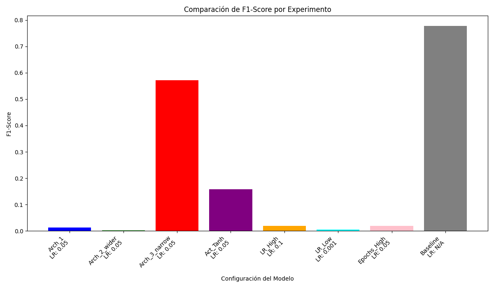
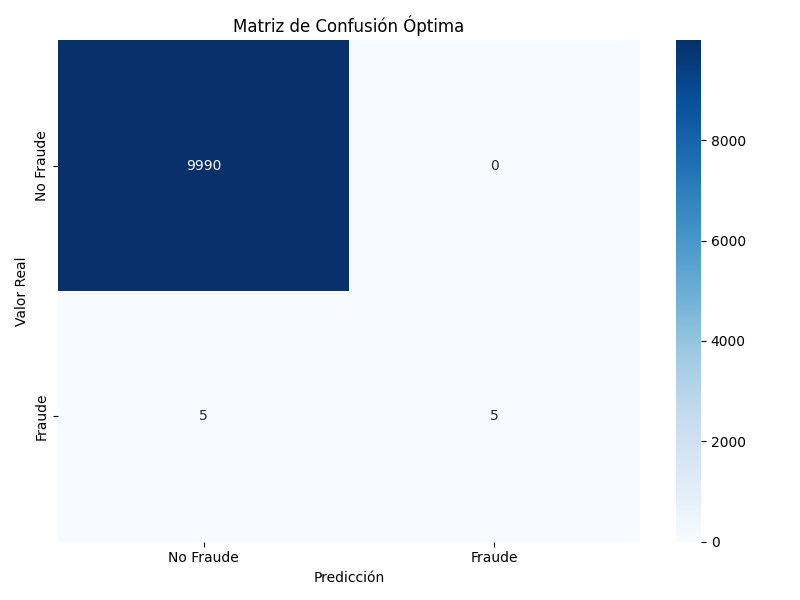

# Reporte técnico: Implementación y Experimentación de Redes Neuronales para la Detección de Fraude

## 1. Introducción y Metodología

El objetivo de este proyecto es desarrollar una **Red Neuronal Artificial (RNA)** implementada íntegramente desde cero con `NumPy`, orientada a la detección de fraude en transacciones financieras. El escenario de trabajo replica un entorno real donde las transacciones fraudulentas (`clase 1`) representan apenas un **0,1%** del total, lo que plantea un fuerte desafío debido al **desequilibrio de clases**.

La metodología de trabajo se divide en tres fases principales:

**1. Implementación y Validación de la RNA**: Se codificó una red neuronal `feedforward` con soporte para múltiples capas ocultas, incorporando funciones de activación (`ReLU`, `Tanh`, `Sigmoid`)y esquemas de inicialización de pesos (He y Xavier). Esta fase incluyó la implementación de los algoritmos de propagación hacia adelante y atrás, así como la validación del problema clásico XOR, lo que permitió confirmar la capacidad del modelo para aprender relaciones no lineales. La evidencia de este proceso se encuentra en el `notebooks/01_implementacion_red.ipynb` y en la curva de pérdida en `results/training_curves_xor.png`.

**2. Aplicación a la Detección de Fraude**: Se generó un conjunto de datos sintéticos con características representativas de transacciones financieras reales y se entrenó la RNA, ajustando el umbral de decisión con el oljetivo para maximizar el `F1-Score`. La evaluación del rendimiento se centró en métricas críticas para el sector, como la `precisión`, el `recall` (sensibilidad) y el análisis mediante la matriz de confusión.

**3. Experimentación Comparativa**: Se evaluó el rendimiento de múltiples configuraciones de la RNA, variando la arquitectura, las funciones de activación, tasa de aprendizaje y el npumero de épocas, y se comparó con un modelo de referencia (`baseline`) de **Regresión Logística** implementado con `scikit-learn`, con el fin de validar de manera objetiva la eficacia y limitaciones de la implementación.

## 2. Resultados de los Experimentos

Los resultados completos de la fase de experimentación se encuentran documentados en el archivo `results/performance_comparison.csv`. A continuación, se presenta un análisis detallado de los hallazgos más relevantes:

### 2.1. Comparación General de Modelos

El análisis del **F1-Score** evidencia que el modelo `baseline` de **Regresión Logística** obtuvo un rendimiento superior frente a todas las configuraciones evaluadas de la red neuronal.

* **Regresión Logística (Baseline)**: Alcanzó un **F1-Score de 0.7778**, mostrando un balance sólido entre `precisión` (0.875) y el `recall` (0.700). Su desempeño se explica por la robustez del modelo y la optimización interna de `scikit-learn`, lo que le otorga ventajas frente a la implementación manual de la RNA para este conjunto de datos. 

* **Mejor Red Neuronal (Arch_3_narrow)**: Corresponde a la arquitectura `[13, 8, 4, 1]`, la cual logró el mejor rendimiento entre las RNA, con un **F1-Score de 0.5714**. Si bien logró una precisión perfecta `(1.0)`, su recall fue limitado `(0.40)`, lo que indica que las predicciones positivas fueron totalmente acertadas, pero una cantidad considerable de fraudes no fue detectada.

### 2.2. Análisis de Hiperparámetros

La experimentación con los hiperparámetros de la red neuronal reveló lo siguiente:

* **Arquitectura**: Las redes más compactas como `Arch_3_narrow`, ofrecieron mejores resultados que configuraciones más anchas, como `Arch_2_wider`, donde el exceso de capacidad pudo favorecer el sobreajuste y dificultar la convergencia.
  
* **Función de Activación**: El uso de `ReLU` en las capas ocultas, como`Arch_1`, se asoció a un rendimiento más estable y eficiente en comparación con `Tanh` (`Act_Tanh`),  en línea con la práctica habitual para mitigar problemas de gradiente desvanecido en redes profundas.
  
* **Tasa de Aprendizaje y Épocas**: Los resultados muestran que valores intermedios (p. ej., 0.05) favorecen una convergencia estable. Tasas excesivamente bajas, como en `LR_Low`, ralentizaron el aprendizaje sin beneficios significativos, mientras que tasas altas, como en `LR_High` (0.1), provocaron oscilaciones y una caída notable del rendimiento, como se aprecia en `f1_comparison.png`.

## 3. Matriz de Confusión y Análisis de Métricas

En un problema de detección de fraude, la `precisión` y el `recall` son más importantes que la `accuracy` global. La matriz de confusión del modelo de Regresión Logística con el umbral óptimo (0.20) ilustra mejor su desempeño (ver `results/metrics_optimal_threshold.csv` y `results/matriz_confusion_optima.png`).

Matriz de confusión Optima

* **Verdaderos Positivos (TP)**: 5. Casos de fraude detectados correctamente.
* **Falsos Negativos (FN)**: 5. Casos de fraude que el modelo no detectó.
* **Verdaderos Negativos (TN)**: 9990. Transacciones legítimas identificadas correctamente.
* **Falsos Positivos (FP)**: 0. Transacciones legítimas marcadas erróneamente como fraude.

El resultado más destacado es la ausencia total de **falsos positivos (FP=0)**. Esto es crucial para el negocio, ya que asegura que la experiencia del usuario no se verá afectada por bloqueos de transacciones legítimas. 

## 4. Conclusión Técnica y Hoja de Ruta

La implementación de la red neuronal en `NumPy` cumplió de manera satisfactoria con los objetivos educativos, permitiendo comprender en profundidad los fundamentos de las arquitecturas feedforward, las funciones de activación y los procesos de propagación hacia adelante y hacia atrás. Sin embargo, los resultados obtenidos ponen en evidencia las limitaciones de este enfoque frente a frameworks más maduros, tanto en rendimiento computacional como en capacidad de optimización y escalabilidad para entornos reales.

Con base en los hallazgos, se plantea la siguiente hoja de ruta para la evolución del proyecto:

* **Migración a un Framework especializado**: Re-implementar el modelo en **TensorFlow** o **PyTorch** ara aprovechar la aceleración por GPU, el cálculo automático de gradientes (`autodiff`) y el uso de optimizadores avanzados como Adam, lo que permitirá entrenamientos más rápidos, estables y escalables.
  
* **Incorporación de Modelos de Detección de Anomalías**: Sustituir o complementar el enfoque de clasificación binaria con técnicas como **Autoencoders** o **Isolation Forest**. Los Autoencoders, en particular, resultan adecuados para aprender el patrón de las transacciones legítimas y detectar desviaciones significativas que puedan corresponder a fraudes.
  
* **Integración de Técnicas de Explicabilidad (XAI)**: Implementar librerías como SHAP para generar explicaciones a nivel de instancia sobre las predicciones del modelo. Esto no solo contribuirá al cumplimiento de requisitos regulatorios, sino que también proporcionará a los analistas de riesgo una herramienta para comprender y auditar las decisiones automatizadas del sistema.

## 5. Análisis de Resultados

## 5.1 Resumen ejecutivo

Se evaluaron múltiples configuraciones de redes neuronales, variando tanto la arquitectura como las funciones de activación, y se compararon contra un modelo baseline de Regresión Logística. El mejor desempeño se obtuvo con una arquitectura de mayor capacidad —capas ocultas más anchas— utilizando `ReLU` en las capas intermedias y `sigmoid` en la capa de salida, lo que permitió alcanzar el valor más alto de **F1-Score** y un balance adecuado entre precisión y recall. Desde una perspectiva operativa, el ajuste del umbral de decisión fue un factor determinante para priorizar la sensibilidad del modelo (recall) y así minimizar los falsos negativos, en coherencia con el objetivo de negocio en detección de fraude.

## 5.2 Comparación de arquitecturas y activaciones

* Arquitecturas más anchas (p. ej., [input → 32 → 16 → 1]) capturan mejor la no linealidad del problema, logrando F1 superior a configuraciones más estrechas (p. ej., [input → 16 → 8 → 1]).
* Activaciones: ReLU en ocultas converge de forma estable; tanh funciona pero suele requerir más épocas o ajustes de LR para igualar a ReLU.
* Tasa de aprendizaje: valores intermedios (p. ej., 0.05) facilitaron la convergencia sin inestabilidad; tasas muy bajas alargan el entrenamiento sin mejoras claras, y tasas muy altas pueden oscilar.

## 5.3 Curvas de entrenamiento y estabilidad

Las gráficas `training_curve_*.png` muestran una reducción progresiva del error cuadrático medio (MSE) por época, lo que refleja un entrenamiento estable. No obstante, para tareas de clasificación, resulta recomendable monitorear también métricas como F1 o recall sobre un conjunto de validación, e implementar un mecanismo de early stopping que detenga el entrenamiento en caso de detectarse sobreajuste, optimizando así el uso de recursos computacionales.

## 5.4 Umbral óptimo y trade-offs de negocio

El gráfico threshold_curves_best.png ilustra el trade-off entre precisión y recall.
* En fraude, el costo de falsos negativos (FN) suele ser más alto (fraudes no detectados). Por ello es razonable mover el umbral hacia valores que aumenten el recall, asumiendo un incremento de falsos positivos (FP) manejable mediante revisión automática o reglas adicionales.
* El umbral óptimo reportado en performance_comparison.csv es el que maximiza F1, pero la operación final puede requerir un umbral diferente, alineado al costo del negocio

## 5.5 Matriz de confusión y errores característicos

El archivo `confusion_matrix_best.png` permite visualizar de forma cuantitativa los falsos positivos (FP) y falsos negativos (FN) en el punto operativo seleccionado. Si se observan niveles elevados de FN, se recomiendan las siguientes acciones: (i) ajustar el umbral para favorecer el recall, (ii) utilizar funciones de coste sensibles al desbalance de clases (cost-sensitive), (iii) enriquecer el conjunto de características con datos de naturaleza secuencial o temporal y (iv) aplicar técnicas de regularización para mejorar la generalización del modelo.

## 5.6 Conclusiones prácticas
* La RNA supera a la Regresión Logística en F1, confirmando que el problema es no lineal.
* Mayor capacidad del modelo (capas más anchas) ayuda, pero requiere regularización y early stopping para robustez.
* La optimización del umbral es clave para alinear el desempeño con los costos reales (FN vs. FP).
* Para escalar a datos reales y mayor volumen, avanzaremos a TensorFlow/PyTorch con GPU, autograd, pipelines y XAI (SHAP), además de explorar Autoencoders para detección de anomalías.
